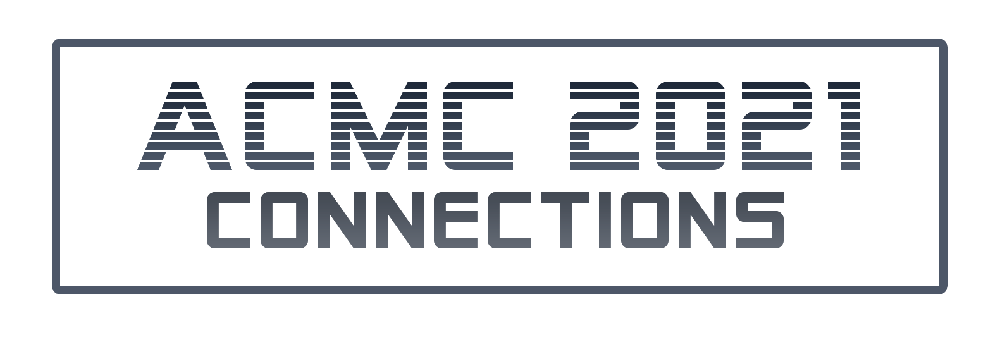

Proceedings of the Australasian Computer Music Conference 2021.
Melbourne, Victoria, and Sydney, New South Wales: held online due to the ongoing COVID-19 pandemic.

[CLICK HERE FOR A PDF VERSION OF THIS DOCUMENT](proceedings.pdf)

## Organising Committee

**Chairs:** Mark Oliveiro and Vincent Giles.

**Committee:** Alice Bennett, Sophie Rose, Ben Swift, Charles Martin, Christina Rowatt, Andy Walton, Michael Higgins.

**Support:** Julian Gough, Sandon Rigg, Hayden Jones, Jourdain Vitiello.

**Student Support:** Daniel Markulic, Dylan Sullivan, Nadiah Jailani, James Ellender, Jean Yap, Jared Tracton, Sigrid Merch, Sun Jin Oh, Shally Pais, Kenner Yoga, Adi Balasubramanian, Gabi Brown, Anna Del Rosario, Laura Parker, Raseca Jallorina, Janvi Jogal, Gene Cleary, Micahel Higgins, Liam Reed.

**Review Personnel:** Charles Martin, Benjamin Swift, Alexander Hunter, Ivan Zavada, Kit Devine, Shally Pais, Vicki Hallett, Massimo Avantaggiato, Diana Scarborough, David Rogerson, David Haberfeld, Lindsay Vickery, Katrina Grant, Terhi Nurmikko-Fuller, Cissi Tsang, Brigid Burke, Skot McDonald, Toby Gifford, Gerardo Dirie, Warren Burt, Aaron Wyatt, Mark Pedersen, Donna Hewitt, Roger Alsop, Edward Neeman, Liz Lea, Anna Terzaroli, Bridget Johnson, Robert Sazdov, Susan Frykberg, Nardi Simpson, James Barbour, Tom Connell, Margaret Schedel, Sophie Rose, Rachael Thoms, Kian Shayan, Dylan Davis, Jordan Lacey, David Kim-Boyle, David Hirst, Scott Davie, Alice Bennett, Carlos Lopez, Tim Kreger, Phillip Johnston, Adrian Bolland.

All copyright remains with the authors.

Proceedings edited and compiled by Vincent Giles, Shally Pais, Anna Del Rosario.

Website, online proceedings, schedule, etc. by Vincent Giles.

All correspondence with authors should be sent directly to the authors.

General correspondence for ACMA should be sent to info@computermusic.org.au

General correspondence for ACMC21 should be sent to conference@computermusic.org.au

[ACMA Website](https://computermusic.org.au)

# Getting Started in Visual Music and AudioVisual Improv

## [Mark Pedersen](mark@chailight.com) and Brigid Burke
### Moderator: Janvi Jogal

## Abstract

As co-curators of SeenSound, a Melbourne-based visual music and
audio-visual improv series, we propose a practical workshop which
introduces participants to both the concepts and the practice of visual
music and audio-visual improv through engagement with historical
examples and hands-on creation of their own performances, either
individually or in small groups.

The practical elements of the workshop will focus on relatively low-cost
software and equipment, including open-source software, raspberry pi
computing platforms and older / DIY audio-visual equipment that is
affordable. The workshop will focus on a playful approach to technology
and visual music concepts and will not assume familiarity with formal
academic context or prior experience with technology. Participants with
advanced technical skills or knowledge will be encouraged to make room
for newcomers and engage with a \"beginner\'s mind\" while exploring the
audiovisual space as a way of refreshing their own creative practice.

## More Information

Topics covered will include:

* building a sense of connection and reciprocity between audio and visual material
* strategies for collecting and assembling raw material
* the use of synthesis vs. concrete materials
* strategies for audiovisual performance

# Mutatis Mutandis: Using Computational Thinking to Interpret Scores by Herbert Brün  
## James Aylward 

### Abstract
This discussion examines the work Mutatis Mutandis (1968/1995) by early computer music pioneer, Herbert Brün (1918-2000).  Brün started his work with computer music in the late 1950s in Paris, then the WDR studio in Cologne and the Siemens studio in Munich.  In 1962 he was invited by Lejaren Hiller to join the faculty at the University of Illinois where he remained for the rest of his working life.  
Next to music, Brün was also a computer graphic artist, a cybernetician, and actively interested in the political and social aspects of music and composition.  It is these elements that influence his work Mutatis Mutandis.  In this piece, Brün presents a number of computer generated graphics, but instead of treating these graphics like a score, performer is given instructions to “construct, by thought and imagination, the interpreter’s version of a structure that might leave the traces which the graphic displays.”  In this sense, he sought a means of stimulating the idea of structured process for the “composing interpreter” rather than simply an activity in attempted reconstruction.  This meta approach can challenge how we view the capability of computers to generate music and what graphic scores can communicate to the performer.  
The author will document and reflect upon the process of preparation of this work for performance. In seeking to develop a version which best combines his creative talents within the bounds of the score, the author will try to develop a deeper understanding and what it means to creatively apply principles of “algorithmic thought” and “cybernetics” to an acoustic performance.  He will also present a recording of a performance of this piece that will demonstrate how computers can indirectly be used to inspire creativity. 

### Author Biographies
Text goes here.

# Musica ex machina: integrating the sonic pallet of machines with acoustic instruments.
## Lindsay Vickery 

### Abstract

Californian composer Robert Erickson was one of the first to directly search for the “music in non-musical sounds” as the inspiration of music with acoustic instruments and electronics. He pioneered the use of analog spectrography to visualise the shapes of complex sound objects. This paper examines the evolution of the practice integrating of pre-recorded mechanical sounds and acoustic instruments. The foundations of the practice of exploring mechanical sound sound as a subject for 'musical' investigation is discussed in relation to Modernist developments including Futurism and Musique Concrète. The discussion will focus on w orks from the last 50 years by Robert Erickson (1917-97), Barry Traux (1947-) Peter Ablinger (1959-), Annie Gosfield (1960-) , James Saunders (1972-) , Joanna Bailie (1973-) and the author.  Techniques employed by composers for combining mechanical sounds and acoustic instruments including spectral analysis, sonification, transcription, resynthesis and transformation will be considered. Issues regarding coordination and sound projection of live and pre-recorded elements will also be addressed.

### Author Biographies

Composer/performer   Vickery’s   music   includes   works   for   acoustic   and   electronic instruments in interactive- electronic, improvised or fully notated settings, ranging from solo pieces to opera and has been commissioned by numerous groups for concert, dance and  theatre. He  is  a  founder  member  of  ensembles  GreyWing  (2016-),  Decibel  (2009- ), HEDKIKR (2001- )  and  Magnetic  Pig  (1993- 2003). He writes and presents on a range of topics,  most  recently  on  the  emergence  of  the  “screenscore”,  nonlinear music  and  the realisation   of   Cage’s   music, in publications/conferences.   He   is   coordinator  of Composition  and  Music  Technology  at  the  WA  Academy  of  Performing  Arts  at  Edith Cowan University.